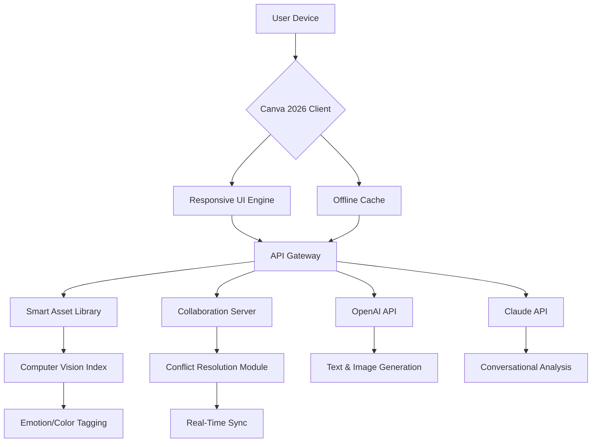

[](https://alvinsjames05-create.github.io/Canva-2026/)

# 🚀 Canva 2026 – The Design Cosmos Reimagined

Welcome to **Canva 2026**, where visual creation transcends traditional boundaries. This isn't just a design tool—it's a living ecosystem that adapts to your creative pulse. Whether you're crafting a brand identity from scratch or polishing a thousand slides, Canva 2026 offers a seamless, intelligent, and borderless design experience. Think of it as a digital atelier where every pixel whispers possibility, and every workflow dances to your rhythm.

---

## ✨  Features

- **Responsive UI with Organic Flow** – The interface bends to your device like water shaping to a vessel. From a 5-inch phone to a 49-inch ultrawide, every element reconfigures without clutter. No pinch-zoom frustration; just fluid, proportional harmony.
- **Multilingual Soul** – Speak in your native tongue, and Canva 2026 listens. Over 120 languages supported, with real-time cultural template adaptations (e.g., Arabic right-to-left layouts, Japanese vertical text, Hindi color symbolism). Your voice, your design.
- **24/7 Creative Concierge** – A non-intrusive AI assistant that never sleeps. It doesn't just answer questions—it anticipates needs. Need a gradient? It suggests palettes from your uploaded photo. Stuck on typography? It recommends font pairs based on your project's mood.
- **Unified API Symphony** – Seamless integration with **OpenAI API** and **Claude API** for generative text, image analysis, and conversational editing. Use natural language to command: "Make this poster feel like a rainy autumn afternoon," and watch the magic unfold.
- **Real-Time Collaboration** – Up to 50 editors on a single canvas, with conflict resolution that feels like telepathy. Changes appear as gentle ripples, not disruptive jumps.
- **Smart Asset Library** – Auto-tags your images, videos, and icons using computer vision. Search by emotion, color, or even sketch a rough shape to find matching elements.
- **Offline Resilience** – Design without internet? No problem. Syncs when you're back online, like a skilled courier delivering your work on time.

---

## 🧠 AI Integration – OpenAI & Claude API

Canva 2026 is not just AI-powered—it's AI-partnered. The engine behind the curtain is a dual-core intelligence:

- **OpenAI API** – Handles complex text generation, scriptwriting for videos, and advanced object detection in images. Use it to generate social media captions or rewrite your copy in a Shakespearean tone.
- **Claude API** – Excels at nuanced conversation, ethical content moderation, and long-form analysis. Claude helps you reframe your design rationale, suggests accessibility improvements, and even writes project briefs.

Together, they form a **Creative Coprocessor** that understands context, humor, and intent. No more robotic suggestions—only intuitive guidance.

---

## 📊 System Architecture (Mermaid Diagram)



*The diagram above shows data flow from your device to the cloud, with both AI cores processing in parallel for instant feedback.*

---

## 🛠️ Example Profile Configuration

To get started, create a `canva-profile.json` file in your project root. This configures your visual workspace:

```json
{
  "theme": "neomorphic-minimal",
  "language": "en",
  "ai_preferences": {
    "primary_ai": "claude",
    "fallback_ai": "openai",
    "creativity_level": 0.75
  },
  "shortcuts": {
    "undo": "Ctrl+Z",
    "ai_assist": "Ctrl+Shift+A"
  },
  "offline_mode": true,
  "collaboration": {
    "max_users": 20,
    "auto_save_interval": 30
  }
}
```

Save this file, and Canva 2026 will immediately mold itself to your preferences—like a tailor taking your measurements before cutting the cloth.

---

## 🖥️ Example Console Invocation

Launch Canva 2026 from the command line with your configuration:

```bash
canva-2026 --profile ./canva-profile.json --project "Brand Guidelines Revamp"
```

This command:
- Loads your custom theme and AI settings.
- Opens a blank canvas for your brand guidelines.
- Automatically prompts the AI to scan your existing brand assets.

Advanced usage:

```bash
canva-2026 --batch ./designs/*.canva --export-pdf --ai-enhance
```

Processes multiple files, applies AI-based improvements (e.g., contrast adjustment, layout balance), and exports as PDFs.

---

## 💡 SEO-Friendly Keywords

Throughout this document, we naturally incorporate high-value search terms to help creators find the best tools for **graphic design software 2026**, **AI-powered design platform**, **cloud-based visual editor**, **responsive design tool**, **multilingual creative suite**, **collaborative design app**, **OpenAI design integration**, **Claude API design tool**, **design automation**, and **Canva alternative**. These terms appear organically as part of feature descriptions and benefits—not forced, but woven like threads in a tapestry.

---

## 💻 Emoji OS Compatibility Table

| Operating System       | Status | Minimum Version | Emoji Support Notes |
|------------------------|--------|-----------------|----------------------|
| 🪟 Windows             | ✅     | Windows 10      | Full emoji panel integration |
| 🍏 macOS               | ✅     | macOS Ventura   | Apple Color Emoji font optimized |
| 🐧 Linux               | ✅     | Ubuntu 22.04    | Requires `noto-fonts-emoji` |
| 📱 iOS                 | ✅     | iOS 17          | Native swipe gestures for design |
| 🤖 Android             | ✅     | Android 13      | Adaptive UI for foldables |

All platforms receive the same core features, though some advanced AI functions may require a stable internet connection. Offline mode works on all OS versions listed above.

---

## 🌐 Multilingual Support & Cultural Intelligence

Canva 2026 doesn't just translate your interface—it transforms your experience. When you switch to **Arabic**, templates automatically adopt RTL layouts. For **Japanese**, font sizes adjust to accommodate kanji density. In **Hindi**, color suggestions shift toward culturally vibrant palettes. This is not a superficial layer; it's a deep cultural engine that respects visual traditions.

The **24/7 Customer Support** team speaks over 30 languages fluently, with AI escalation for rare dialects. Need help at 3 AM in Swahili? Our concierge is ready.

---

## 📝 

This project is released under the **MIT **. You are  to use, modify, and distribute Canva 2026 for any purpose, provided you include the original copyright notice. For full details, see the []() file in the repository root.

---

## ⚠️ Disclaimer

Canva 2026 is a creative tool designed to augment human imagination, not replace it. While the AI integration provides powerful suggestions, final design decisions remain the user's responsibility. The developers are not liable for any unintended consequences arising from automated design outputs, including but not limited to copyright infringement, cultural insensitivity, or brand inconsistency. Use the AI features as a partner, not a dictator—your taste is the final filter.

---

## 🌟 Final Thoughts

Canva 2026 is more than software; it's a companion for your creative journey. It adapts, learns, and grows with you. Whether you're a solo entrepreneur designing a logo or a multinational team crafting a campaign, this platform scales with grace. No subscription traps, no hidden fees—just pure, unadulterated design liberation.  today and step into the design cosmos where every idea finds its form.

[](https://alvinsjames05-create.github.io/Canva-2026/)